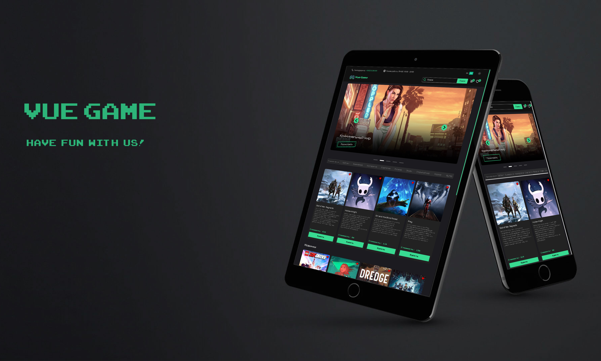

# Разработка интернет-магазина - Vue Game

Vue Game - это проект, который я разработал с нуля, начиная с проектирования интерфейса и заканчивая разработкой фронтенда. Для дизайна я использовал инструмент Figma, а для реализации пользовательского интерфейса выбрал фреймворк Vue.js. В качестве бэкенда я использовал сервисы для JSON данных [MockAPI](https://mockapi.io/) и [Cloudinary](https://cloudinary.com/).

Взаимодействие между фронтендом и бэкендом осуществляется посредством API запросов. Чтобы управлять состоянием приложения, я применил Vuex.

### Используемый стек технологий:

- Vue.js;
- Vuex;
- Vue router;
- SASS(SCSS);
- MockAPI;
- Cloudinary;
- Axios;
- Swiper;
- i18n;
