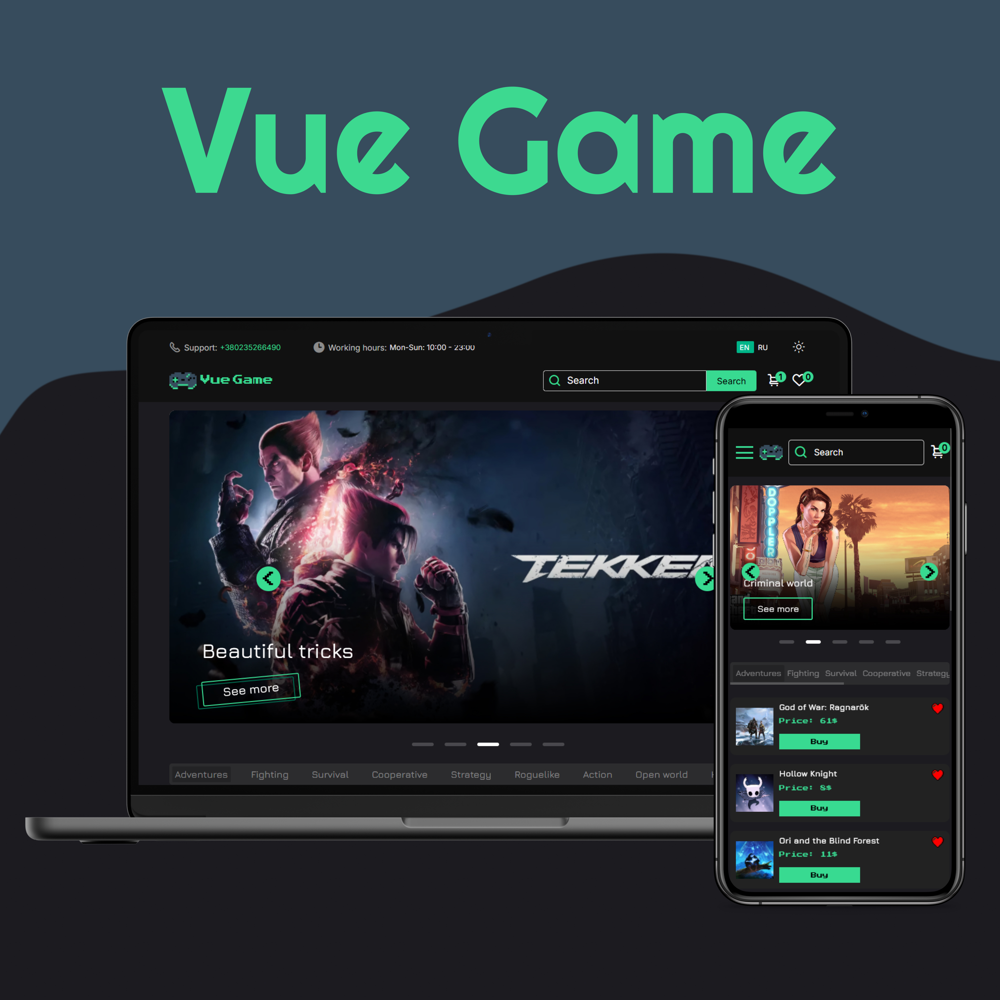

    

# Vue Game

Modern e-commerce web application for purchasing digital games, built with Vue.js. The project includes catalog browsing, product filtering, multilingual support, shopping cart management, and API integration.

---

## 📋 Project Information

| Property | Value |
|----------|-------|
| **Project Type** | E-commerce Web Application |
| **Role** | Frontend Developer |
| **Status** | Completed |
| **Architecture** | SPA (Single Page Application) |
| **Responsive** | ✅ Yes |
| **Cross-browser** | ✅ Yes |
| **Framework** | Vue.js |
| **Deployment** | GitHub Pages |

---

## 📖 Description

Vue Game is a modern single-page e-commerce application for browsing and purchasing digital games. The project was developed from scratch, including UI implementation, application architecture, state management, routing, and integration with external APIs.

The application uses MockAPI as a backend for product data and Cloudinary for image storage. Vuex is used for global state management, while Vue Router provides seamless page navigation.

---

## ✨ Key Features

- Product catalog.
- Product details page.
- Shopping cart management.
- Category and product filtering.
- Search functionality.
- Image gallery slider.
- Responsive interface.
- Multi-language support (i18n).
- Client-side routing.
- Dynamic data loading from API.

---

## 🛠 Development

- Built with Vue.js 3.
- Global state management using Vuex.
- Routing with Vue Router.
- REST API integration using Axios.
- Internationalization with Vue I18n.
- Drag & Drop support using VueDraggable.
- Modular SCSS architecture.
- Reusable Vue components.
- Optimized application structure.

---

## 🎯 Result

The project demonstrates the development of a complete Vue.js e-commerce application with API integration, responsive design, state management, and multilingual support while maintaining a scalable and maintainable architecture.

---

## 💻 Technologies

- Vue.js
- Vuex
- Vue Router
- JavaScript (ES6+)
- Axios
- Vue I18n
- Swiper
- VueDraggable
- SCSS
- MockAPI
- Cloudinary
